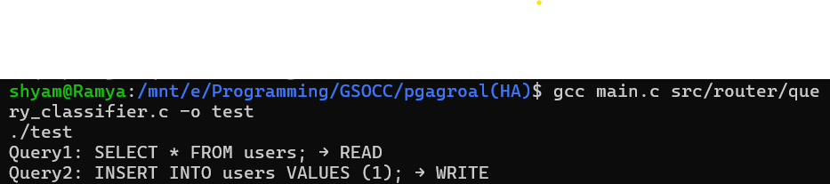
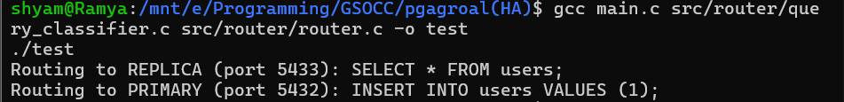
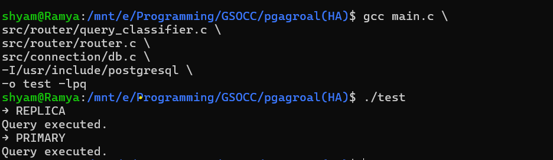
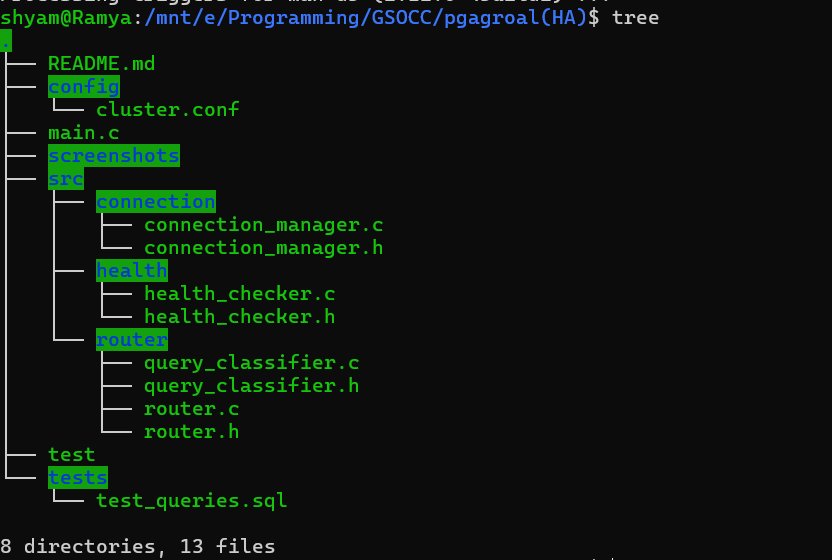

# pgagroal High Availability (HA) Prototype

## Overview

This project implements a **basic High Availability (HA) prototype** for pgagroal, enabling intelligent routing of SQL queries between a PostgreSQL primary and replica instance.

---

##  Current Progress

### 🔹 1. Query Classification

* Implemented logic to classify SQL queries as:

  * **READ** → `SELECT`, `SHOW`, `DESCRIBE`
  * **WRITE** → `INSERT`, `UPDATE`, `DELETE`

📸 Example Output:

## 📸 Query Routing Output

---

### 🔹 2. Query Routing

* Built routing module:

  * READ queries → Replica (Port 5433)
  * WRITE queries → Primary (Port 5432)

📸 Example Output:

---

### 🔹 3. PostgreSQL Integration (libpq)

* Integrated PostgreSQL C client (`libpq`)
* Queries are now executed on actual database instances
* Connection handling implemented using:

  * `PQconnectdb`
  * `PQexec`
  * `PQgetvalue`

📸 Example Output:

---

### 🔹 4. Multi-Cluster PostgreSQL Setup

* Configured two PostgreSQL instances:

  * **Primary** → Port 5432
  * **Replica** → Port 5433
* Enabled password-based authentication (md5)

---

### 🔹 5. Modular Architecture

##  Key Concepts Implemented

* Query parsing (lightweight classification)
* Read/Write splitting
* Database connection using C (libpq)
* Multi-instance PostgreSQL setup
* Modular system design

---

##  Current Limitations

* No real replication yet
* No failover handling
* No health checking
* Replica is currently independent

---

##  Next Steps

* Implement **Health Checker**
* Add **Failover mechanism**
* Enable **real primary-replica replication**
* Add **lag-aware routing**

---

## Author

Shyam Pandey
